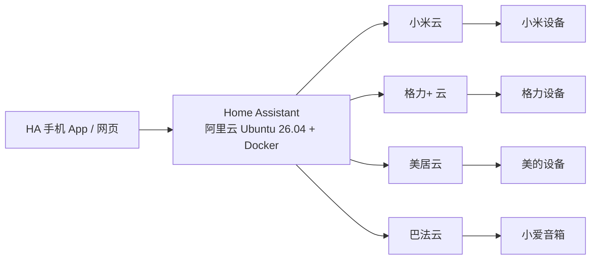

# 三品牌智能家居统一控制平台


一个入口统一控制**小米、格力、美的**三个品牌的智能家居设备。系统基于 Home Assistant（HA）部署在阿里云服务器上，手机端使用 HA App / 网页端，小爱语音通过巴法云桥接。

## 架构



## 为什么这样做

- 原方案：每个品牌一个 App → 各品牌自己的云服务器 → 设备。
- 本方案：一个 HA App → HA（阿里云，7×24 在线）→ 三家品牌云接口 → 设备。
- 原品牌 App 保留作为备用。

## 技术决策

| 项目 | 选择 |
| --- | --- |
| 云服务器系统 | Ubuntu 26.04 LTS（Resolute Raccoon） |
| 部署方式 | Docker Compose 运行 HA 官方容器 |
| 端口 | 8123（可在安全组/compose 中改） |
| 小米接入 | `al-one/hass-xiaomi-miot`（云服务器用账号云模式）；官方 `XiaoMi/ha_xiaomi_home` 仅适用家庭局域网 |
| 美的接入 | `sususweet/midea_auto_cloud`（美居云 API） |
| 格力接入 | davo22/homeassistant-gree-cloud（Gree Climate Cloud，格力+ 云，非官方） |
| 小爱语音 | `skddyj/bemfa`（巴法云） |

## 目录结构

```text
.
├── CHANGELOG.md               # 更新记录
├── docker-compose.yml        # HA 容器编排
├── config/                   # HA 配置目录（服务器运行时生成，不入库）
├── scripts/
│   ├── setup-server.sh       # 安装 Docker Engine + Compose 插件
│   ├── install-hacs.sh       # 在 HA 容器内安装 HACS
│   └── sync-github.ps1       # 每 24 小时自动同步 GitHub
├── LICENSE                  # MIT 许可
└── docs/
    ├── runbook.md            # 从零到可用的完整实施手册
    └── test-plan.md          # 测试与验收清单
```

## 快速开始

完整步骤见 [docs/runbook.md](docs/runbook.md)，核心三步：

1. 把本项目放到服务器（git clone 或 scp）。
2. `sudo ./scripts/setup-server.sh` 安装 Docker。
3. `sudo docker compose up -d` 启动 HA，访问 `http://<服务器IP>:8123`。


## 部署状态（2026-08-12）

- 服务器：`<服务器公网IP>`，Ubuntu 26.04 LTS（已添加 2G swap）。
- 已完成：Docker 29.7.2 + Compose v5.4.0；HA 容器已启动；HACS 已安装（国内镜像）。
- 镜像说明：官方 `ghcr.io` 在国内拉取慢，已通过 `ghcr.nju.edu.cn` 镜像拉取并打回官方标签。
- 已安装集成：xiaomi_miot、xiaomi_home、midea_auto_cloud、gree_cloud、bemfa（手动安装；GitHub 直连不稳时使用 ghfast.top 代理）。
- 统一仪表盘已上线：http://<服务器公网IP>:8123/lovelace/unified-dashboard（含格力空调、美的洗衣机、小米设备与“全屋关空调”按钮）。
- 爸妈模式已上线：http://<服务器公网IP>:8123/lovelace/elder-mode（大字大按钮，适合长辈使用）。
- 小爱语音：bemfa 已配置（格力空调、洗衣机开关、全屋关空调已同步至巴法云）；待用户在米家 App 绑定巴法云账号。
- 待完成：个性化自动化（定时/离家回家模式）。
## 安全与回退

- 管理员账号必须设置强密码并开启两步验证（2FA）。
- 凭据、HA 运行时配置不入库；敏感信息见 `.gitignore`。
- 项目文件通过 git 回退；HA 运行时数据通过 HA 自动备份恢复。
- 免费阿里云实例若为限时试用，到期前按 [docs/runbook.md](docs/runbook.md) 第 11 节备份并迁移。
